# Project Argus

## Summary  

The purpose of this project is to classify a growth as either Malignant ("M") or Benign ("B").   
We want to REDUCE the occurance of FALSE NEGATIVES as much as possible.  
That is: we want to avoid telling someone they do not have cancer, when in fact they do.   
This is the [Jupyter notebook](argusMain.ipynb).  
These are the [script functions](argusFuncs.py).   
Here is a [powerpoint format](jcosme-project3.pptx) of the presentation, and here is a [pdf format](jcosme-project3.pdf) of the presentation.  
Here is the script for the [streamlet UMAP app](exploringUMAP.py).

### Outline  
+ The Data
+ Simple Models
+ Ensemble Model Idea
+ Building Ensemble Model
+ Results
+ Conclusion

## The Data

The data contains 569 labeled breast cancer observations  
It was obtained from [uci](https://archive.ics.uci.edu/ml/machine-learning-databases/breast-cancer-wisconsin).

Each observation contains the following:  
+ id
+ diagnosis
+ radius_mean
+ texture_mean
+ perimeter_mean
+ area_mean
+ smoothness_mean
+ compactness_mean
+ concavity_mean
+ concave_points_mean
+ symmetry_mean
+ fractal_dimension_mean
+ radius_se
+ texture_se
+ perimeter_se
+ area_se
+ smoothness_se
+ compactness_se
+ concavity_se
+ concave_points_se
+ symmetry_se
+ fractal_dimension_se
+ radius_worst
+ texture_worst
+ perimeter_worst
+ area_worst
+ smoothness_worst
+ compactness_worst
+ concavity_worst
+ concave_points_worst
+ symmetry_worst
+ fractal_dimension_worst

We will split the data RANDOMLY into Train (70%), Dev (15%), and Test (15%) segments, as shown:

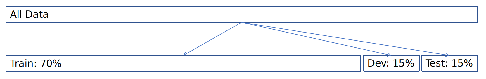

To start, we will work with the Train data set:

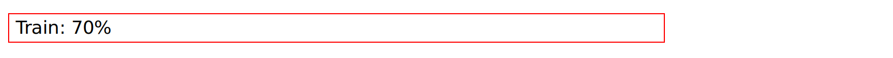

## Simple Models

We create 3 simple models (on the Train data set), to use as a basis:
+ Logistic Regression
+ KMeans
+ Neural Net  

We make predictions on the Test set and Dev set.   

Here are the confusion matrices:

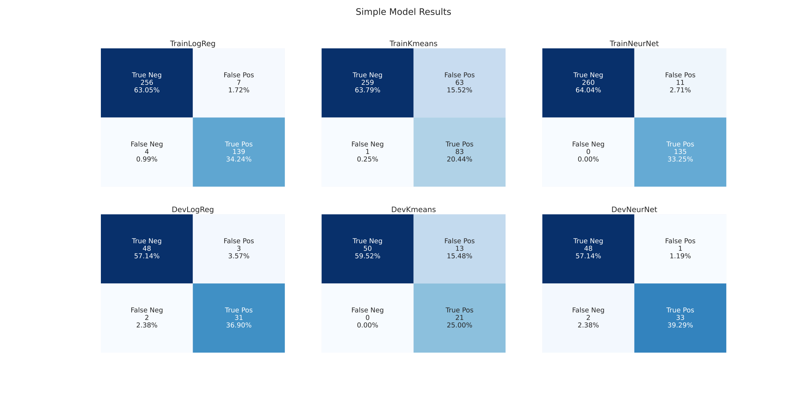

From the above, we can see that the KMeans has the lowest rate of False Positives, but with a disproportionately higher False Negative rate.   
We can also see that the Neural Network gives inconsistent False Negative/Positive results.  
Of the 3 models, the Logistic Regression seems to be the most stable.

## Ensemble Model Idea

In a perfect world, our data would look like this, in two dimensions, and be easily linearly separable: 

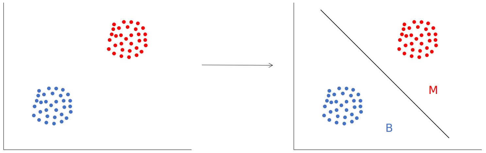

However, this is not a perfect world, so maybe our data looks more like this:

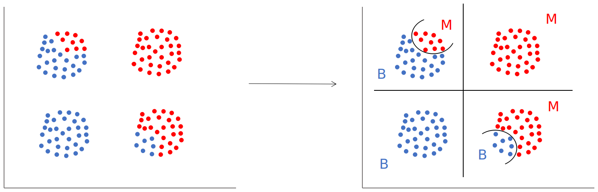

The idea is to group the data into distinct clusters, then build separate models on each cluster, that predict data labels. 

We have a problem: our data has 30 dimensions, not 2.

Therefore, we will need a way to reduce the dimensionality of our data, before we can perform clustering.  
When finished, our ensemble model will look something like this:

 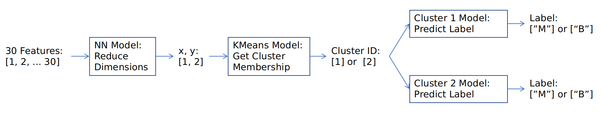

## Building Ensemble Model

We must decided on a method for dimensionality reduction. We skip over the traditional PCA, and explore these two:
+ TSNE
+ UMAP

We would like to select the method that creates the strongest delineation into two groups.   
Here are two methods performed on the Train data:

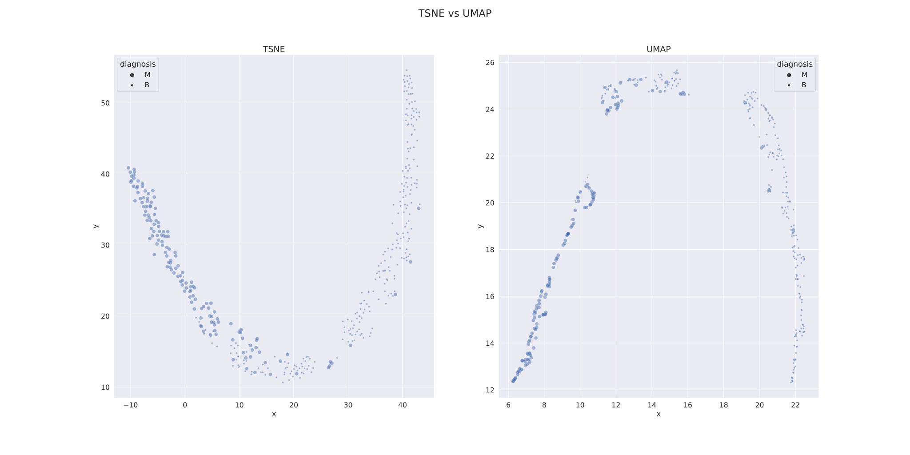

Because we feel the UMAP method provides stronger delineation, we will proceed with this method. 

Next, we use the X, Y output of the UMAP to train a KMeans model, with 2 clusters. 
Here are the cluster predictions for the Train set:

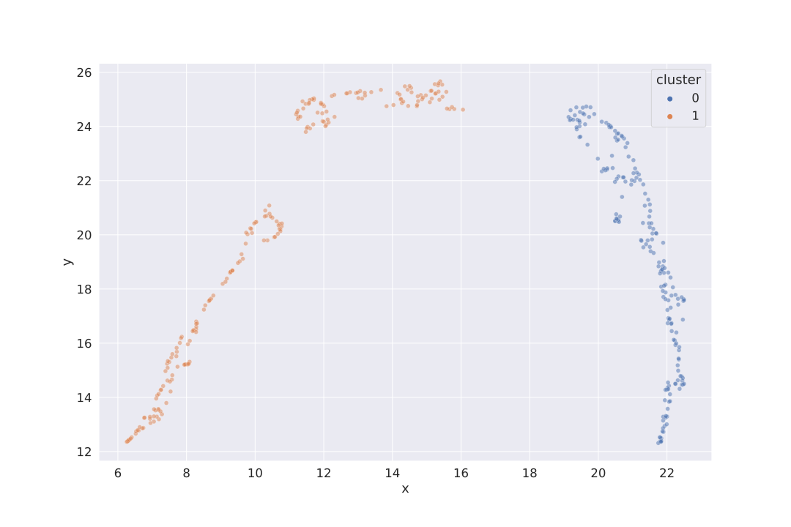

On each of the clusters, we train a model to predict the data labels ("M" or "B").   
Here is the confusion matrix for the cluster model predictions on the Train set:

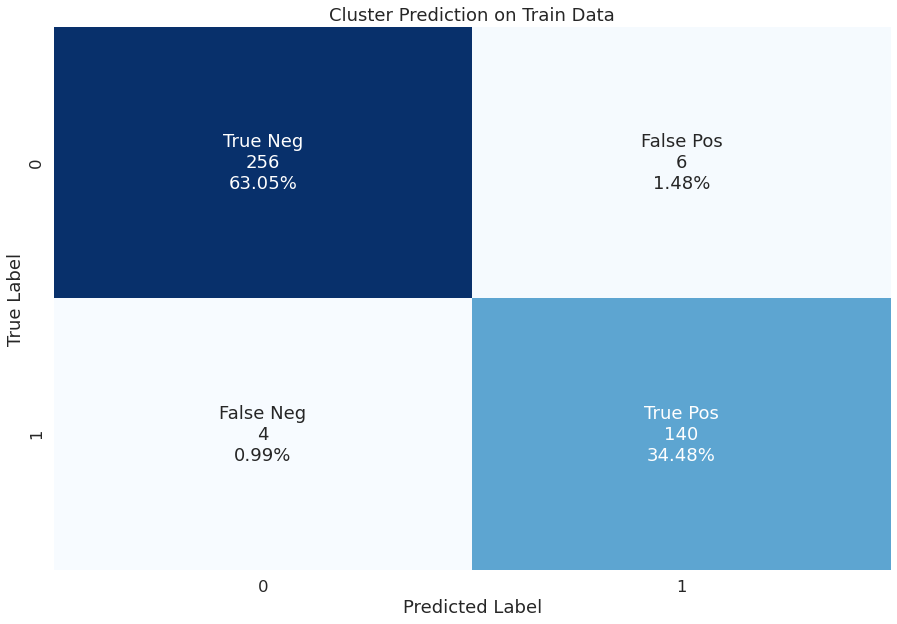

### HUGE PROBLEM: UMAP uses a stochastic process!

UMAP uses a stochastic process for mapping its dimensionality reduction.   
This means that the results will be different each time the function is run, even if the underlying data is the same!

You can you this [streamlet UMAP app](exploringUMAP.py) to explore the problem.

Ultimately, we cannot use the UMAP method for dimentionality reduction, because it is impossible to "train" a UMAP model that will reduce the dimensions of new data.

### HUGE PROBLEM: workaround

Instead, we will train a Neural Network work to mimic our UMAP results. 

First, we take our Train data set, and split it further into TrainL2, DevL2, and TestL2 sets, as show below:

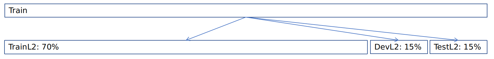

And we will build our model using the TrainL2 set. 

Many models were built, with many different hyperparameters for different number of layers, numer of neurons, activation functions, learning rates, optimization algorithms, and loss functions, 

For the sake of simplicity, we will summarize the results for 3 loss function:
+ MSLE
+ MAPE
+ Huber

as shown here:

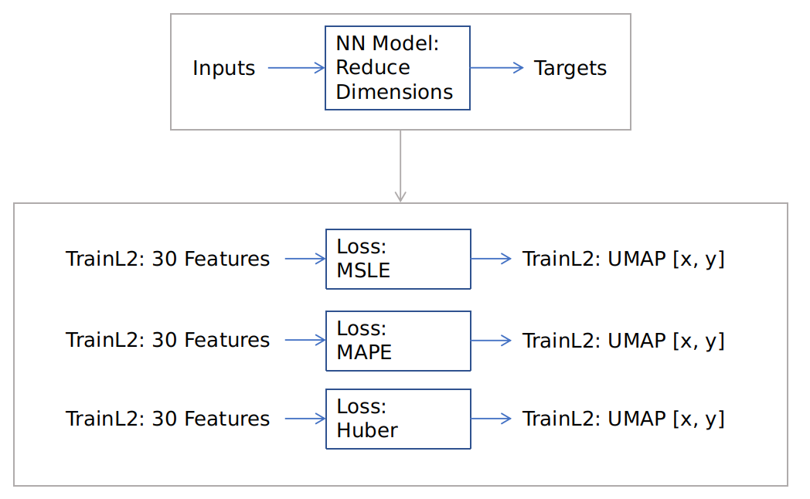

The reason we selected these three loss functions for tested was because we are wanting to see clear deliniations in our reduced dimension.   
MSLE is a standard to compare the rest to; it is a common loss function.   
MAPE was chosen because it calculates losses bases on the relative error for a point, rather than the absolute error for a point. Essentially, an error of 100 on a datapoint with a value of 1000 would normally have a greater impace than an error of 10 on a datapoint with a value of 100, but with MAPE (mean absolute PERCENT error), both the erros are treated as 10%.    
The Huber loss function is resistant to outliers. Many loss functions use the "mean," and a mean is easily skewed by outliers. The Huber loss function tries to mitigate this.

Here are what the Neural Nets predict for the TrainL2 and DevL2 sets. 

BLUE = ACTUAL   
RED = PREDICTED
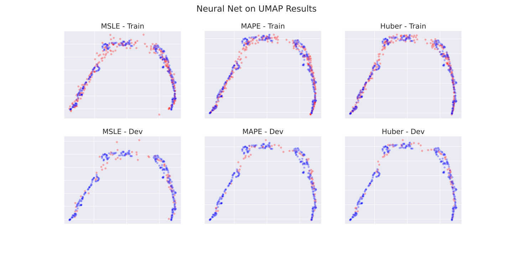

Both the MAPE and Huber provide good delineation. 

We will make predictions for the DevL2 and TestL2, and use the KMeans on the predictions to predict cluster membership.    
We then compare the predicted cluster membership to the true cluster memberships, and we will select the loss function that predicts the most correct memberships.

The results on the DevL2 are:
+ the KMeans model was able to predict 66 correct memberships with the MSLE loss function on the Dev set
+ the KMeans model was able to predict 67 correct memberships with the MAPE loss function on the Dev set
+ the KMeans model was able to predict 67 correct memberships with the Huber loss function on the Dev set
+ Total observations in Dev set is: 70

The results on the TestL2 are:
+ the KMeans model was able to predict 54 correct memberships with the MSLE loss function on the Test set
+ the KMeans model was able to predict 55 correct memberships with the MAPE loss function on the Test set
+ the KMeans model was able to predict 56 correct memberships with the Huber loss function on the Test set
+ Total observations in Test set is: 56

Huber has the highest score, so we will use Huber. 

Finally, we train a Neural Network on the entire, original Train set, using the Huber loss function.    
These are the parameters for the Dimensionality Reduction Neural Network:
+ number of layers: 31
+ number of neurons: L1-L30: 240; L31: 2
+ activation functions: swish
+ learning rate: 0.0001
+ optimizer: Adam (with AMSGrad)
+ epochs: 1,000

We now have all of our models built, and we can move on. 

## Results 

Using our Ensemble model, we make label predictions on the Dev data set.
Here are our results:

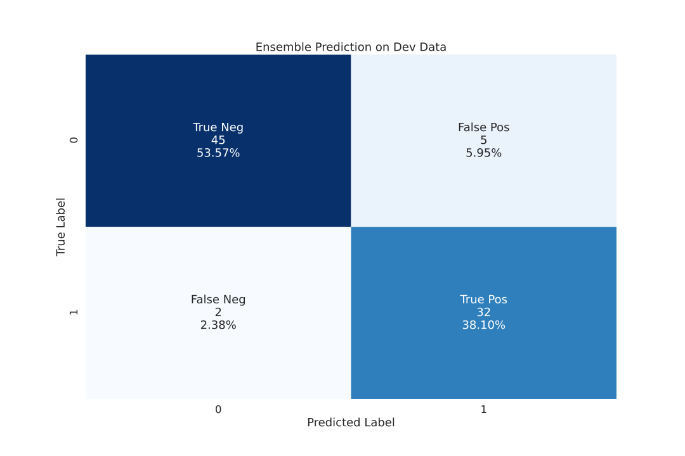

The results are mediocre. Same False Negative rate as the Logistic Regression Model on the Dev set, but worse False Positive rate. 

Lets compare our Ensemble model to the Logistic Regression mode on the test set:

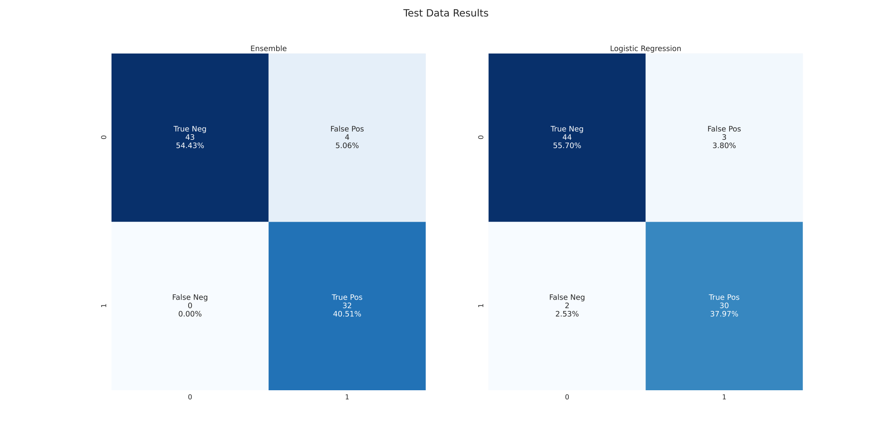

The results on the Test set look better for our Ensemble model, with a False Negative rate of 0%.

## Conclusion

I would not rely on this model. 
Here are the reasons:
+ Does not give consistent results; any good results could be because of data split
+ Does not significantly outperform a simple Logistic Regression Model (and is far more complex).
+ Have less than 600 data points; NEED MORE DATA.

Additionally, UMAP uses a stochastic method of reducing dimensionality. Because our data was normalized, we assumed it was homogeneous. If data is not homogeneous, any stochastic method would be greatly inappropriate (using a stochastic dimension reduction method in itself in inadvisable in general, if we are wanting to reduce the dimensions of new, unseen, data).  

